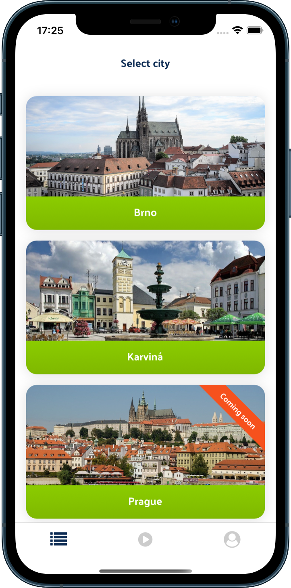
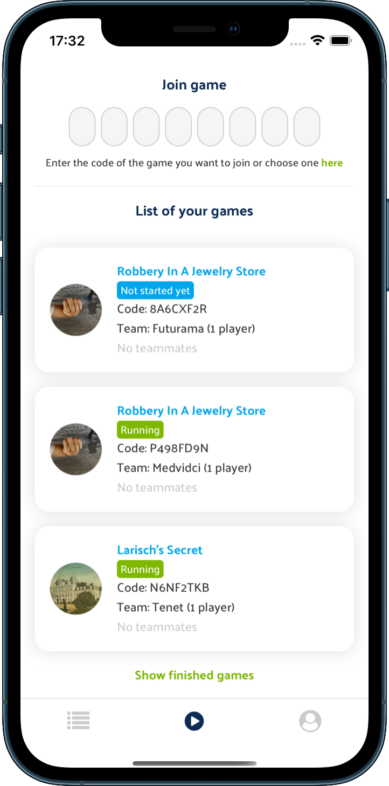
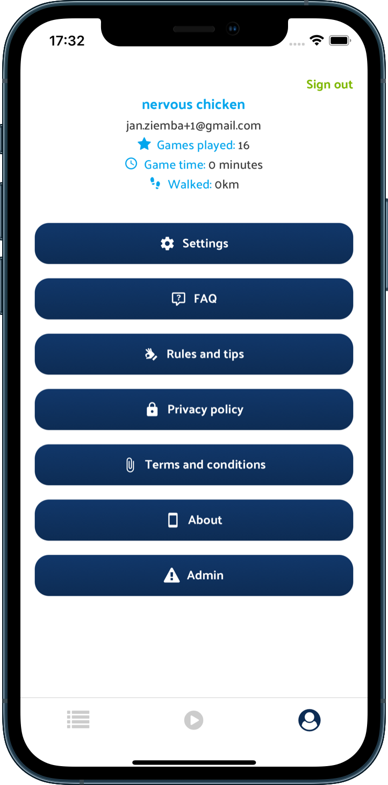
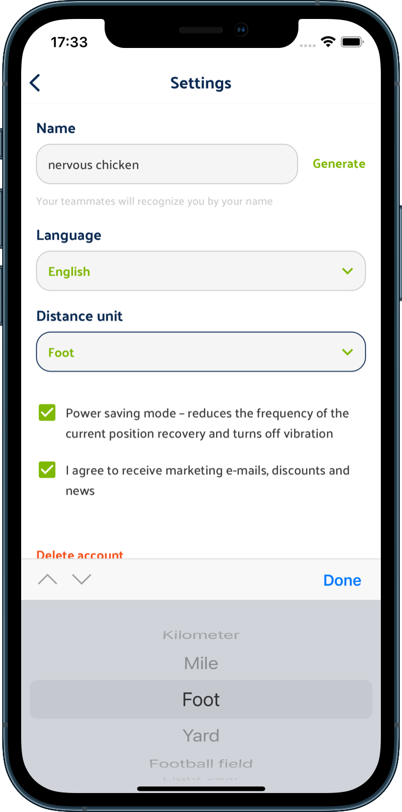
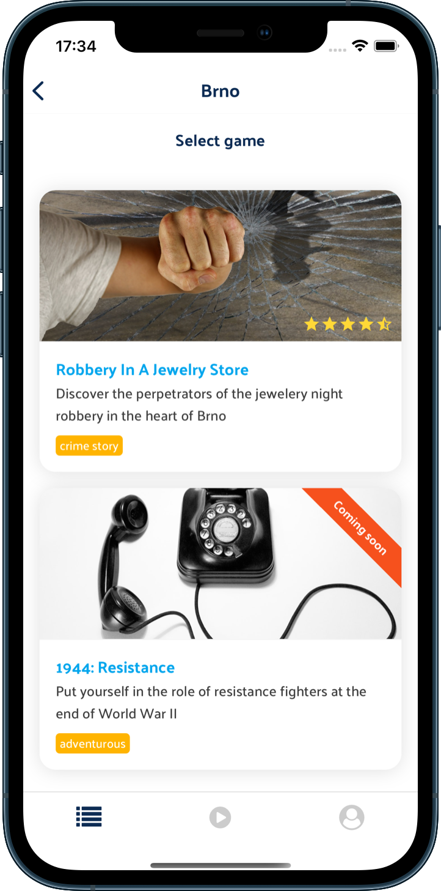
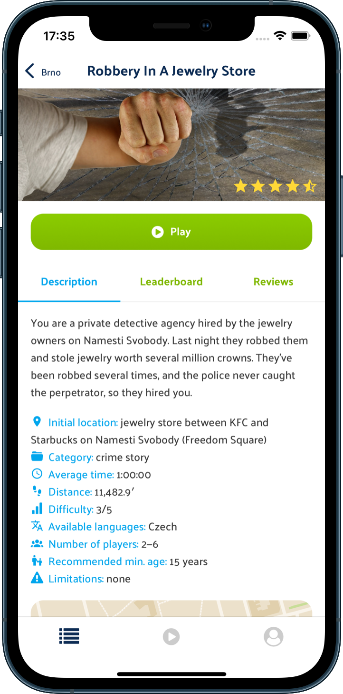

# React Native Basic UI

## ⚠️ Documentation in progress

-   ✅ highly performant
-   ✅ lightweight
-   ✅ customizable
-   ✅ easy to use
-   ✅ typed
-   ✅ documented
-   ✅ accessible

[](https://www.npmjs.com/package/react-native-basic-ui)

[](https://img.shields.io/npm/dm/react-native-basic-ui.svg)
[](https://www.npmjs.com/package/react-native-basic-ui)
[](https://raw.githubusercontent.com/janziemba/react-native-basic-ui/master/LICENSE)

## Screenshots








## Getting started

```sh
yarn add react-native-basic-ui
```

Also, complete [react-native-vector-icons installation](https://github.com/oblador/react-native-vector-icons#installation), otherwise you won't be able to use the Icon component.

## Usage

### Theme provider

You have to add a theme context to your app's root component. A default theme will be used.

```jsx
import { ThemeProvider } from 'react-native-basic-ui';

const App = () => {
    return (
        <ThemeProvider>
            ...
        </ThemeProvider>
    );
}
```

### Theme config

But you can set your own primitives and overwrite the default theme. For example:

```jsx
import { defaultTheme, ThemeProvider } from 'react-native-basic-ui';

const customTheme = {
    ...defaultTheme,
    colors: {
        primary: 'green',
    },
};

const App = () => {
    return (
        <ThemeProvider value={customTheme}>
            ...
        </ThemeProvider>
    );
}
```

### Components

Once you have included [ThemeProvider](#theme-provider) in your app, you can use the components:

```jsx
import { Button, CenterContainer } from 'react-native-basic-ui';

const ExampleComponent = () => {
    return (
        <CenterContainer>
            <Button text="Hello world" />
        </CenterContainer>
    );
};
```

### Custom components with the theme

To use the theme in your own components, you can use `useStyles` hook. You can define styles while using theme primitives:

```jsx
import { useStyles } from 'react-native-basic-ui';

const injectTheme = ({ colors, radiuses, spacing }) =>
    StyleSheet.create({
        container: {
            backgroundColor: colors.primary,
            borderRadius: radiuses.medium,
            borderTopColor: colors.white,
            marginBottom: spacing.small,
        },
    });

const ExampleComponent = () => {
    const styles = useStyles(injectTheme);

    return (
        <View style={styles.container}>
            ...
        </View>
    );
};
```

### Accessing the theme

And you can also access the theme object anywhere in the app:

```jsx
import { useTheme } from 'react-native-basic-ui';

const ExampleComponent = (props) => {
    const { isError } = props;
    const { colors } = useTheme();

    const color = isError ? colors.danger : colors.primary;

    return (
        <Text style={{ color }}>
            Hello world
        </Text>
    );
};
```

## Author

### Jan Ziemba

Checkout my <a href="https://www.react-native.cz" title="React Native Developer" target="_blank">React Native portfolio website</a>

<a href="https://www.buymeacoffee.com/janziemba" target="_blank"></a>

## License

[MIT](LICENSE), © 2021 Jan Ziemba
